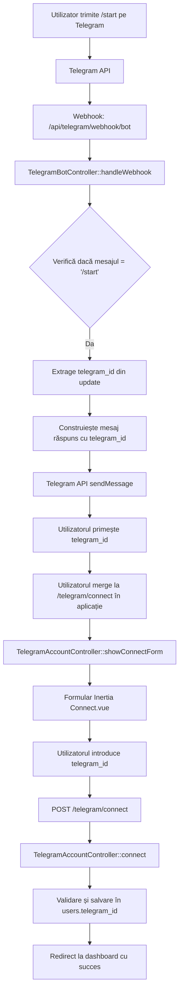
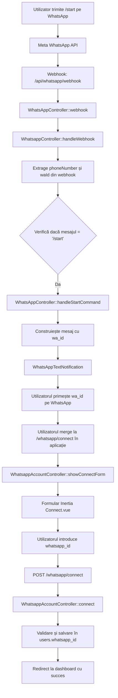
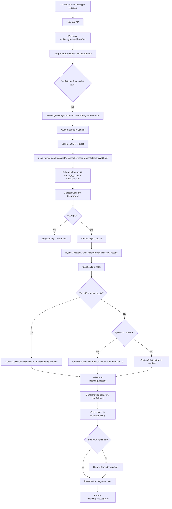
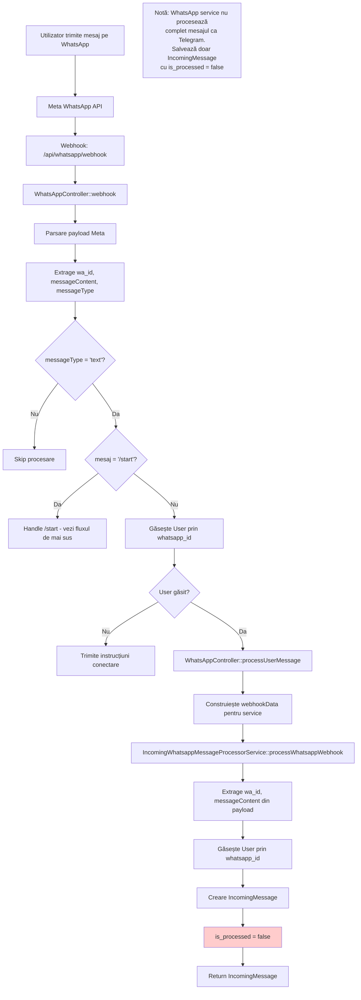
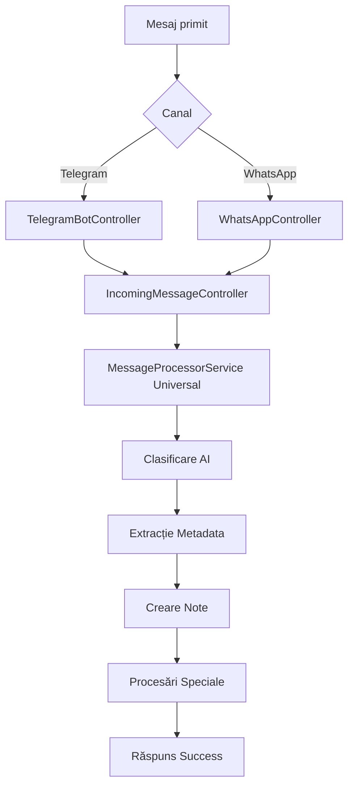

# Fluxul Mesajelor Telegram și WhatsApp în MicroNote

## Prezentare Generală

Această documentație descrie fluxul complet al mesajelor pentru aplicația MicroNote, incluzând integrările Telegram și WhatsApp. Aplicația procesează două tipuri principale de mesaje:

1. **Comanda `/start`** - pentru conectarea conturilor
2. **Mesaje simple** - pentru crearea notițelor

---

## 1. Fluxul pentru Comanda `/start`

### 1.1 Telegram `/start`



**Fișiere implicate:**
- `routes/api.php:15` - Ruta webhook Telegram
- `app/Http/Controllers/Telegram/TelegramBotController.php:27-41` - Procesare `/start`
- `routes/web.php:32-35` - Rute conectare Telegram
- `app/Http/Controllers/Telegram/TelegramAccountController.php:13-31` - Controller conectare

### 1.2 WhatsApp `/start`



**Fișiere implicate:**
- `routes/api.php:17` - Ruta webhook WhatsApp
- `app/Http/Controllers/WhatsAppController.php:84-127` - Procesare `/start`
- `app/Http/Controllers/Whatsapp/WhatsappController.php:43-52` - Procesare alternativă `/start`
- `routes/web.php:38-41` - Rute conectare WhatsApp
- `app/Http/Controllers/Whatsapp/WhatsappAccountController.php:15-38` - Controller conectare

---

## 2. Fluxul pentru Mesaje Simple

### 2.1 Telegram - Mesaj Simplu



**Fișiere implicate:**
- `app/Http/Controllers/Telegram/TelegramBotController.php:45-48` - Verificare non-/start
- `app/Http/Controllers/IncomingMessageController.php:25-49` - Handler webhook Telegram
- `app/Services/Telegram/IncomingMessage/IncomingTelegramMessageProcessorService.php:36-152` - Procesare completă

### 2.2 WhatsApp - Mesaj Simplu



**Observație Importantă:** Serviciul WhatsApp (`IncomingWhatsappMessageProcessorService`) este incomplet comparativ cu cel Telegram. Nu face:
- Clasificare AI a mesajelor
- Extracție shopping list/reminder
- Creare automată Note
- Procesare completă

**Fișiere implicate:**
- `app/Http/Controllers/WhatsAppController.php:155-183` - Procesare mesaj user
- `app/Services/Whatsapp/IncomingMessage/IncomingWhatsappMessageProcessorService.php:18-81` - Service incomplet

---

## 3. Diferențe Importante între Telegram și WhatsApp

### 3.1 Completitudinea Procesării

| Caracteristică | Telegram | WhatsApp |
|----------------|----------|----------|
| Clasificare AI | ✅ Completă | ❌ Lipsește |
| Extracție shopping list | ✅ Da | ❌ Nu |
| Extracție reminder | ✅ Da | ❌ Nu |
| Creare Note automată | ✅ Da | ❌ Nu |
| Generare titlu AI | ✅ Da | ❌ Nu |
| Increment notes_count | ✅ Da | ❌ Nu |

### 3.2 Structura Controllerelor

**Telegram:**
- `TelegramBotController` - Webhook și comenzi
- `TelegramAccountController` - Conectare cont

**WhatsApp:**
- `WhatsAppController` - Webhook principal (complet)
- `WhatsappController` - Webhook alternativ (în `Whatsapp/`)
- `WhatsappAccountController` - Conectare cont

### 3.3 Diferențe de Implementare

**Telegram - Flux Complet:**
1. Primește webhook → Procesează imediat mesajul
2. Clasificare AI → Extracție metadata → Creare Note
3. Integrare completă cu toate funcționalitățile

**WhatsApp - Flux Incomplet:**
1. Primește webhook → Salvează doar IncomingMessage
2. Nu clasifică, nu extrage metadata, nu creează Note
3. Necesită procesare ulterioară (probabil prin job-uri)

---

## 4. Modele de Date Implicate

### 4.1 User Model
```php
// app/Models/User.php
protected $fillable = [
    'telegram_id',      // Pentru Telegram
    'whatsapp_id',      // Pentru WhatsApp 
    'whatsapp_phone',   // Telefon WhatsApp
    'notes_count'       // Contorizare note
];
```

### 4.2 IncomingMessage Model
```php
// app/Models/IncomingMessage.php
protected $fillable = [
    'user_id',
    'source_type',          // 'telegram' sau 'whatsapp'
    'sender_identifier',    // telegram_id sau wa_id
    'message_content',
    'ai_tag',              // Doar pentru Telegram
    'is_processed',        // false pentru WhatsApp
    'processed_at',
    'metadata'
];
```

---

## 5. Rute API și Web

### 5.1 Rute Webhook (API)
```php
// routes/api.php
Route::post('/telegram/webhook/bot', [TelegramBotController::class, 'handleWebhook']);
Route::match(['get', 'post'], '/whatsapp/webhook', [WhatsAppController::class, 'webhook']);
```

### 5.2 Rute Conectare (Web)
```php
// routes/web.php
Route::get('/telegram/connect', [TelegramAccountController::class, 'showConnectForm']);
Route::post('/telegram/connect', [TelegramAccountController::class, 'connect']);
Route::get('/whatsapp/connect', [WhatsappAccountController::class, 'showConnectForm']);
Route::post('/whatsapp/connect', [WhatsappAccountController::class, 'connect']);
```

---

## 6. Recomandări pentru Dezvoltare

### 6.1 Completarea WhatsApp
Pentru ca WhatsApp să funcționeze la fel ca Telegram:

1. **Extinde `IncomingWhatsappMessageProcessorService`:**
   - Adaugă clasificare AI
   - Implementează extracție shopping list/reminder  
   - Crează Note automat
   - Adaugă increment notes_count

2. **Unifică controllerele WhatsApp:**
   - Folosește un singur controller principal
   - Elimină duplicarea de logică

### 6.2 Arhitectura Generală
- Ambele canale ar trebui să urmeze același flux final
- Service-urile ar trebui să implementeze aceeași interfață
- Procesarea să fie uniformă indiferent de sursă

---

## 7. Fluxul Ideal Unificat (Recomandare)



Această arhitectură ar asigura consistența între canale și ar facilita mentenanța codului.