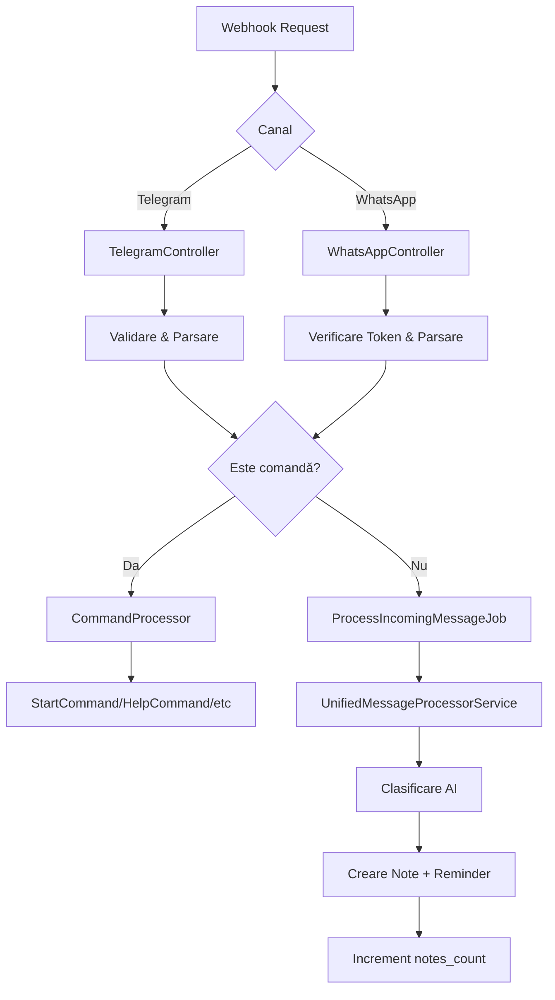

# Plan de Refactorizare - Sistem de Mesaje Unificat

## 🎯 Obiective

Refactorizarea sistemului de procesare mesaje pentru a elimina duplicarea de cod, simplifica arhitectura și implementa procesare asincronă uniformă pentru ambele canale (Telegram și WhatsApp).

## 🔍 Problemele Actuale

### Duplicare și Inconsistență
- `incomingMessageRepository->create()` duplicat în ambele servicii
- WhatsApp incomplet (doar salvare `IncomingMessage`) vs Telegram complet (clasificare AI + Note)
- Logica `/start` împrăștiată în locuri diferite
- Două controllere WhatsApp (`WhatsAppController` și `Whatsapp/WhatsappController`)

### Responsabilități Amestecate
- Controllere fac prea multe (validare + procesare + comenzi)
- `IncomingMessageController` este intermediar inutil
- Servicii specifice cu logică similară

## 🏗️ Arhitectura Țintă



## 📋 Faze de Implementare

### **Faza 1: Command Pattern pentru Comenzi**

#### 1.1 Creează Interfața Comenzilor
```php
// app/Services/Commands/Contracts/CommandInterface.php
interface CommandInterface
{
    public function handle(string $channelType, string $identifier, array $metadata): bool;
    public function getCommand(): string;
}
```

#### 1.2 Implementează StartCommand
```php
// app/Services/Commands/StartCommand.php
class StartCommand implements CommandInterface
{
    public function getCommand(): string { return '/start'; }
    
    public function handle(string $channelType, string $identifier, array $metadata): bool
    {
        // Logica unificată pentru /start
        // Trimite ID-ul specific (telegram_id sau wa_id)
        // Suportă ambele canale
    }
}
```

#### 1.3 Command Processor (Dispatcher)
```php
// app/Services/Commands/CommandProcessor.php
class CommandProcessor
{
    public function process(string $message, string $channelType, string $identifier, array $metadata): bool
    {
        // Identifică comanda din mesaj
        // Găsește handler-ul potrivit
        // Execută comanda
    }
}
```

### **Faza 2: Job Asincron pentru Mesaje**

#### 2.1 Creează Job-ul Principal
```php
// app/Jobs/ProcessIncomingMessageJob.php
class ProcessIncomingMessageJob implements ShouldQueue
{
    public function __construct(
        private string $channelType,        // 'telegram' sau 'whatsapp'
        private string $identifier,         // telegram_id sau wa_id
        private string $messageContent,
        private array $rawData,
        private string $correlationId
    ) {}
    
    public function handle(UnifiedMessageProcessorService $processor): void
    {
        $processor->processMessage(
            $this->channelType,
            $this->identifier,
            $this->messageContent,
            $this->rawData,
            $this->correlationId
        );
    }
}
```

### **Faza 3: Serviciu Unificat de Procesare**

#### 3.1 UnifiedMessageProcessorService
```php
// app/Services/Messaging/UnifiedMessageProcessorService.php
class UnifiedMessageProcessorService
{
    public function processMessage(
        string $channelType,
        string $identifier,
        string $messageContent,
        array $rawData,
        string $correlationId
    ): ?IncomingMessage {
        // 1. Găsește User prin identifier (telegram_id sau whatsapp_id)
        // 2. Salvează IncomingMessage
        // 3. Clasificare AI (HybridMessageClassificationService)
        // 4. Extracție metadata (shopping lists, reminders)
        // 5. Creare Note cu titlu generat AI
        // 6. Creare Reminder dacă e cazul
        // 7. Increment notes_count
        // 8. Return result
    }
}
```

### **Faza 4: Controllere Simplificate**

#### 4.1 TelegramController Refactorizat (Organizat pe Canale)
```php
// app/Http/Controllers/Telegram/TelegramController.php
namespace App\Http\Controllers\Telegram;

class TelegramController extends Controller
{
    public function handleWebhook(Request $request, CommandProcessor $commandProcessor): JsonResponse
    {
        // 1. Validare webhook Telegram
        // 2. Extragere date (telegram_id, message_content)
        // 3. Verificare dacă e comandă → CommandProcessor
        // 4. Dacă nu e comandă → ProcessIncomingMessageJob::dispatch()
        // 5. Return response rapid
    }
}
```

#### 4.2 WhatsAppController Unificat (Organizat pe Canale)
```php
// app/Http/Controllers/WhatsApp/WhatsAppController.php  
namespace App\Http\Controllers\WhatsApp;

class WhatsAppController extends Controller
{
    public function webhook(Request $request, CommandProcessor $commandProcessor): Response
    {
        // GET: Verificare webhook_verify_token
        // POST: 
        // 1. Validare webhook Meta
        // 2. Extragere date (wa_id, message_content)
        // 3. Verificare dacă e comandă → CommandProcessor
        // 4. Dacă nu e comandă → ProcessIncomingMessageJob::dispatch()
        // 5. Return response rapid
    }
}
```

### **Faza 5: Cleanup și Eliminări**

#### 5.1 Fișiere de Șters
- `app/Http/Controllers/IncomingMessageController.php`
- `app/Http/Controllers/Whatsapp/WhatsappController.php` (duplicat)
- `app/Services/Telegram/IncomingMessage/IncomingTelegramMessageProcessorService.php`
- `app/Services/Whatsapp/IncomingMessage/IncomingWhatsappMessageProcessorService.php`

#### 5.2 Rute de Actualizat
```php
// routes/api.php
use App\Http\Controllers\Telegram\TelegramController;
use App\Http\Controllers\WhatsApp\WhatsAppController;

Route::post('/telegram/webhook/bot', [TelegramController::class, 'handleWebhook']);
Route::match(['get', 'post'], '/whatsapp/webhook', [WhatsAppController::class, 'webhook']);
```

## 🗂️ Structura Finală (Organizată pe Canale)

```
app/
├── Jobs/
│   └── ProcessIncomingMessageJob.php
├── Services/
│   ├── Commands/
│   │   ├── Contracts/
│   │   │   └── CommandInterface.php
│   │   ├── StartCommand.php
│   │   ├── HelpCommand.php (viitor)
│   │   └── CommandProcessor.php
│   └── Messaging/
│       └── UnifiedMessageProcessorService.php
└── Http/Controllers/
    ├── Telegram/
    │   ├── TelegramController.php           # Controller principal pentru webhook
    │   ├── TelegramAccountController.php    # Linking conturi (existent)
    │   └── TelegramWebhookController.php    # Configurări webhook (viitor)
    └── WhatsApp/
        ├── WhatsAppController.php           # Controller principal pentru webhook
        ├── WhatsappAccountController.php    # Linking conturi (existent)
        └── WhatsAppWebhookController.php    # Configurări webhook (viitor)
```

### 🎯 Avantaje Organizare pe Canale:
- **Separare logică** - fiecare canal își are propriul namespace
- **Extensibilitate** - poți adăuga mai multe controllere specifice fiecărui canal
- **Organizare** - mai ușor de găsit și întreținut codul
- **Scalabilitate** - dacă aplicația crește, fiecare canal poate avea multiple controllere

## 🔄 Fluxul Final Simplificat

### Pentru Comenzi (/start, /help, etc.)
1. **Webhook** → Controller specific
2. **Controller** → Parsare + validare rapidă
3. **Controller** → `CommandProcessor::process()`
4. **CommandProcessor** → Găsește și execută comanda
5. **Command** → Răspuns direct către utilizator

### Pentru Mesaje Normale
1. **Webhook** → Controller specific  
2. **Controller** → Parsare + validare rapidă
3. **Controller** → `ProcessIncomingMessageJob::dispatch()`
4. **Job** (asincron) → `UnifiedMessageProcessorService`
5. **Service** → Procesare completă (AI + Note + Reminder)

## ✅ Beneficii

### DRY (Don't Repeat Yourself)
- Un singur serviciu pentru procesarea mesajelor
- Logica comenzilor centralizată în Command Pattern
- Eliminarea duplicărilor între Telegram și WhatsApp

### KISS (Keep It Simple)
- Controllere simple care doar validează și delegă
- Responsabilități clare pentru fiecare componentă
- Fluxuri liniare și predictibile

### YAGNI (You Ain't Gonna Need It)
- Nu supracomplicăm cu pattern-uri inutile
- Interface-uri doar unde chiar avem extensibilitate
- Arhitectură care permite creștere naturală

### Asincronă și Scalabilă
- Webhook-urile răspund rapid (sub 3 secunde)
- Procesarea grea se face asincron prin queue
- Posibilitatea de retry automat la erori

## 🚀 Pași de Execuție

1. **Implementează Command Pattern** (1-2 zile)
2. **Creează Job-ul asincron** (1 zi)
3. **Dezvoltă UnifiedMessageProcessorService** (2-3 zile)
4. **Refactorizează controllere** (1-2 zile)
5. **Testing și cleanup** (1-2 zile)
6. **Update documentație** (0.5 zile)

**Total estimat: 6.5 - 10.5 zile**

## 📝 Note de Implementare

- Păstrează backward compatibility pe perioada refactorizării
- Implementează logging detaliat pentru debugging
- Testează pe ambele canale în paralel
- Monitorizează performance-ul queue-urilor
- Documentează API-ul intern pentru viitoare extensii

---

*Acest plan respectă principiile DRY, KISS, YAGNI și standardele Laravel/Vue.js definite în CLAUDE.md*